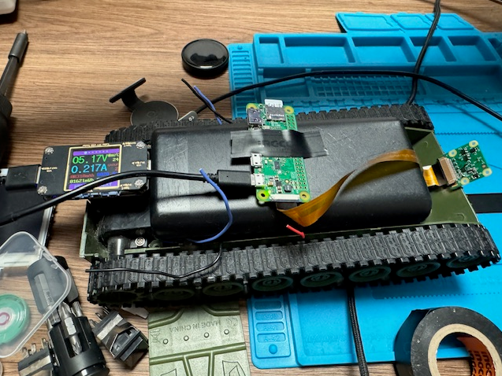
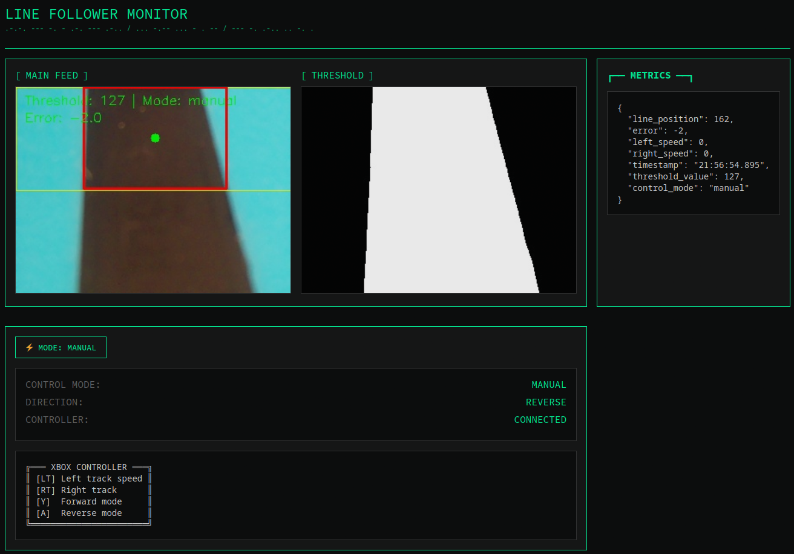

# Line Following Robot with Web Control Interface 🤖

Hey! Want to see something cool? I built this autonomous line following robot that you can also control manually with an Xbox controller. It's like having the best of both worlds - hands-free operation when you want it, and full control when you need it.

## WORK IN PROGRESS

This robot is under development. Some features are missing.

## What's the deal?

The robot uses a Pi Camera to track a black line on a light surface. I've built a sexy web interface that shows you exactly what the robot sees and lets you switch between autonomous and manual control on the fly.

## The Good Stuff

- Auto mode: Robot follows the line by itself
- Manual mode: Take control with Xbox controller triggers
- Real-time camera feed with line detection overlay
- Threshold view so you can see what the robot sees
- Live metrics for nerding out about speeds and positions
- Forward/Reverse control with Y/A buttons
- Cyberpunk-inspired UI because why not? 😎

Built with Python on a Raspberry Pi Zero W. The interface is all HTML/JS doing its thing in your browser. Simple but gets the job done!
